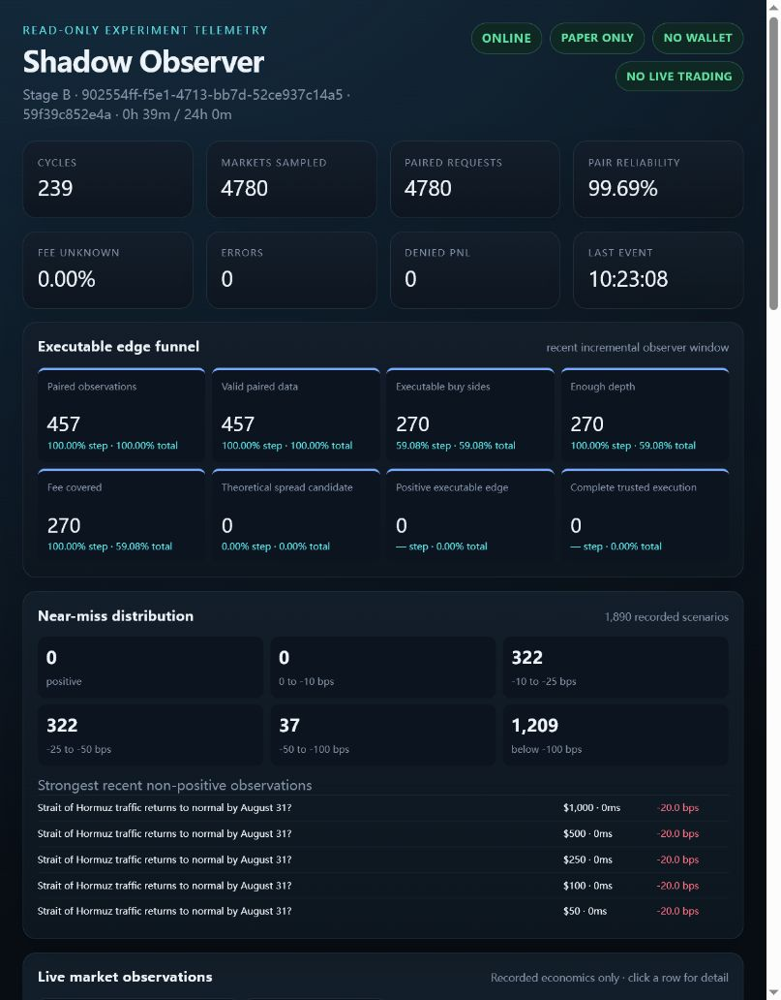
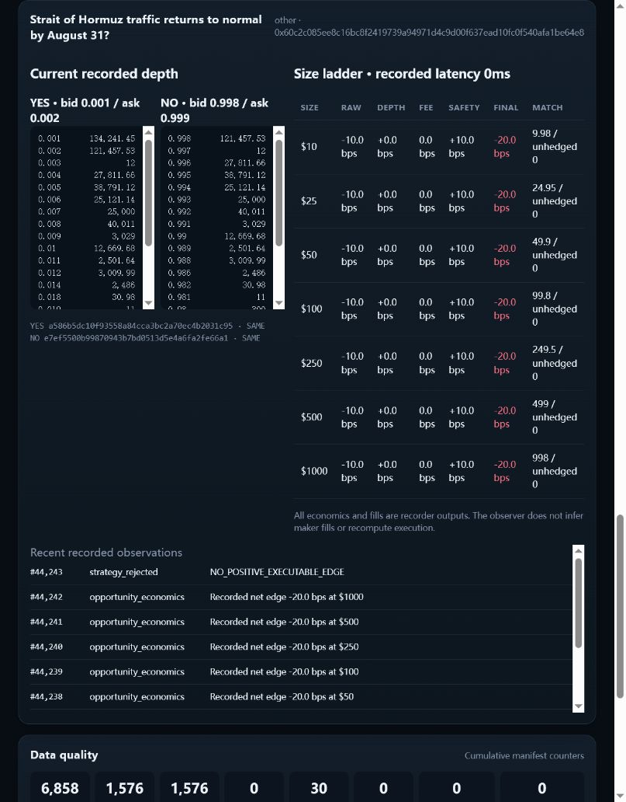

# Shadow Observer V1

Shadow Observer is a read-only CloddsBot gateway page for observing an existing trusted Long Shadow run. It is not a trading dashboard and does not start, stop, restart, configure, or execute the experiment.

Implementation branch: `feat/shadow-observer-v1`  
Implementation base: `59f39c852e4ac93caa821a6246f50f9987dc0a5c`  
Observed Stage B run: `902554ff-f5e1-4713-bb7d-52ce937c14a5`

## Read-only boundary

The observer server:

- requires `NO_PRIVATE_KEY=true`, `NO_WALLET=true`, and `NO_LIVE_TRADING=true` before startup;
- imports the recorder data reader and Express only—not wallet, signing, order, execution, strategy-control, or experiment lifecycle services;
- registers only `GET`/`HEAD` routes under `/shadow`;
- rejects every mutating method with `405 READ_ONLY_OBSERVER`;
- binds to `127.0.0.1` by default;
- never writes to the Shadow run directory;
- exposes no order, strategy, threshold, wallet, signing, approval, live-trading, or Shadow lifecycle control.

The only interactive elements are local table sorting, a market/question filter, a category filter, and opening a read-only market detail view.

## Data contract

The existing Stage B artifacts remain the sole source of truth:

- `manifest.json` supplies cumulative run, safety, data-quality, fee, hash, and funnel counters.
- `events.jsonl` supplies recorded book topology, raw/normalized book references, official timestamps/hashes, recorded opportunity economics, attribution, and important events.
- The frontend displays the recorder's `pnlAttribution`, simulated fills, VWAP, fee status, and funnel flags. It does not reimplement execution economics.

The observer labels cumulative values and recent-window values separately. A bounded JSONL tail is read once for live tables and distributions; subsequent refreshes read only newly appended bytes. The default initial window is 16 MiB and may be set with `--tail-mb`. This avoids rescanning a growing JSONL file from byte zero every three seconds and keeps observer I/O independent from recorder writes.

If the event file shrinks beneath the reader cursor, the observer reports `EVENT_FILE_TRUNCATED` and marks the view blocked instead of silently rebuilding or accepting corrupt provenance.

## Routes

| Method | Route | Purpose |
|---|---|---|
| GET | `/shadow` | Shadow Observer HTML page |
| GET | `/shadow/api/snapshot` | Overview, recent-window funnel, markets, near misses, quality, important events |
| GET | `/shadow/api/market/:marketId` | Current recorded depth, size ladder, attribution, hashes, and recent observations |

All other methods under `/shadow` return `405`.

## Page contents

### Overview

Shows ONLINE/STOPPED/BLOCKED, stage, run ID, commit, uptime/target, cycles, sampled markets, paired requests, pair reliability, fee-unknown rate, errors, denied-PnL count, last event time, and permanent PAPER ONLY / NO WALLET / NO LIVE TRADING badges.

### Edge funnel

The consistent recent observer window shows:

```text
paired observations
-> valid paired data
-> executable buy sides
-> enough depth
-> fee covered
-> theoretical spread candidate
-> positive executable edge
-> complete trusted execution
```

Each stage shows count, prior-step conversion, and conversion from paired observations. Theoretical spread and executable edge are distinct recorded conditions.

### Near misses

Recorded net economics are bucketed as positive, 0 to -10 bps, -10 to -25 bps, -25 to -50 bps, -50 to -100 bps, and below -100 bps. The panel also shows the five strongest recent non-positive observations. Negative values are never relabeled as opportunities.

### Market table and detail

The sortable/filterable table shows market/question, conservative metadata category, topology, YES/NO best asks, raw sum, recorded $10/$100 edge, available share depth, fee status, state age, hash-change age, and update time.

The detail view shows current YES/NO depth, best bid/ask, official book hashes and change state, recorded 0ms size-ladder economics for $10/$25/$50/$100/$250/$500/$1000, recorded attribution, matched/unhedged quantities, and recent observations. No maker fill is inferred.

Categories are conservative: authoritative sports metadata is preferred; explicit market/event text is used only for clear crypto, macro/economics, or politics labels; ambiguous markets remain `other`.

### Data quality and event stream

The quality panel shows cumulative TWO_SIDED, BID_ONLY, ASK_ONLY, EMPTY, MISSING, INVALID, REQUEST_FAILED, and TRANSPORT_STALE states; pair reliability; fee known/disabled/unknown; transport and state-age percentiles; and hash INITIAL/SAME/CHANGED.

The important event stream retains structural and exceptional events and caps ordinary market-batch updates at the five most recent entries. It does not render every raw book or economics event.

## Exact preview command

PowerShell:

```powershell
$env:NO_PRIVATE_KEY='true'
$env:NO_WALLET='true'
$env:NO_LIVE_TRADING='true'

npm run shadow-observer -- `
  --run-dir "E:\AI\Polymarket Strategy Lab\shadow_runs\long-shadow-v1-stage-b-24h-20260830" `
  --host 127.0.0.1 `
  --port 4311 `
  --tail-mb 16
```

Open `http://127.0.0.1:4311/shadow`.

Port 4311 was used for preview because another local service already occupied the default port 4310. The observer did not stop or modify that service.

## Preview evidence

Overview:



Market detail:



The preview read the live Stage B artifacts while they continued to grow. The first request read exactly the configured 16 MiB tail; a later request read only bytes appended since the prior cursor. A POST to the snapshot endpoint returned `405`.

## Verification

- Observer unit/integration tests: 3 passed, 0 failed.
- TypeScript typecheck: passed.
- Full build: passed after permission was granted to create the isolated worktree's generated `dist` directory.
- Browser preview: ONLINE, 20 current market rows, five strongest near misses, five capped market-batch events, no buttons, no forms, and only filter/sort inputs.
- Market detail preview: seven size levels, current recorded depth, official hashes, and recent observation stream rendered from Stage B artifacts.

## Stage B isolation

The observer work was created in:

```text
E:\AI\Polymarket Strategy Lab\vendors\CloddsBot-shadow-observer
```

The running Stage B process remained in the original `freeze/long-shadow-v1` worktree. It was not rebuilt, checked out, restarted, stopped, or reconfigured. The observer opened its artifacts read-only.
